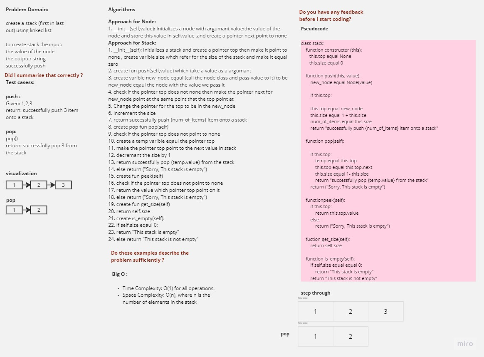
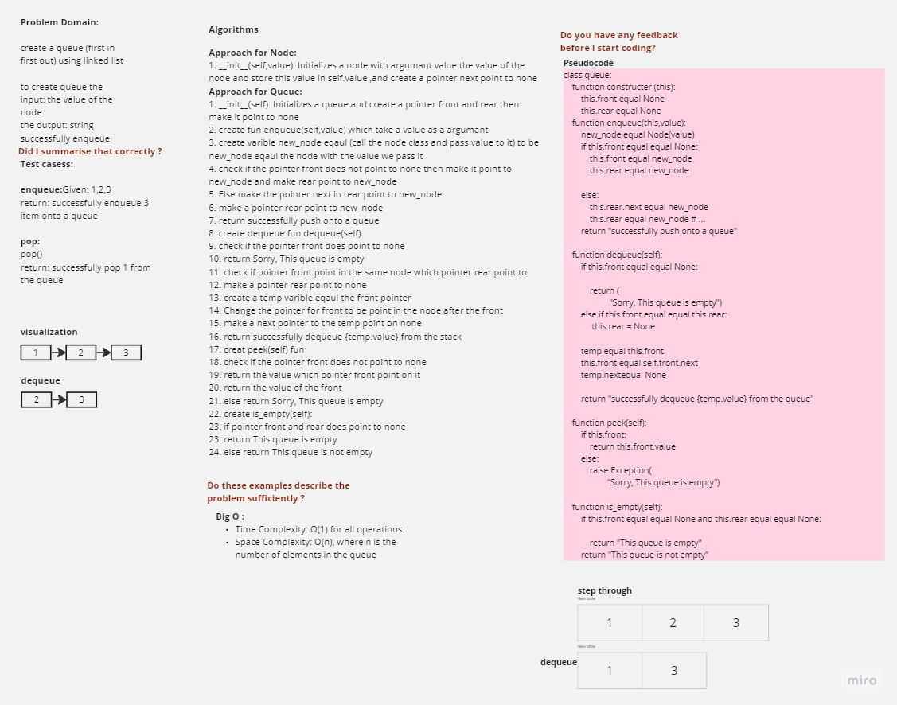

# Stack & Queue
Both the stack and queue are the linear data structure, which means that the elements are stored sequentially and accessed in a single run

## Whiteboard Process
stack:

queue:

## Approach & Efficiency
Approach for Node:
1. __init__(self,value): Initializes a node with argumant value:the value of the node and store this value in self.value ,and create a pointer next point to none

Approach for Stack:
1. __init__(self): Initializes a stack and create a pointer top then make it point to none , create varible size whch refer for the size of the stack and make it equal zero
2. create fun push(self,value) which take a value as a argumant
3. create varible new_node eqaul (call the node class and pass value to it) to be new_node eqaul the node with the value we pass it
4. check if the pointer top does not none then make the pointer next for new_node point at the same point that the top point at 
5. Change the pointer for the top to be in the new_node
6. increment the size
7. return successfully push {num_of_items} item onto a stack
8. create pop fun pop(self)
9. check if the pointer top does not point to none
10. create a temp varible eqaul the pointer top
11. make the pointer top point to the next value in stack 
12. decremant the size by 1 
13. return successfully pop {temp.value} from the stack
14. else return ("Sorry, This stack is empty")
15. create fun peek(self)
16. check if the pointer top does not point to none
17. return the value which pointer top point on it
18. else return ("Sorry, This stack is empty")
19. create fun get_size(self)
20. return self.size
21. create is_empty(self):
22. if self.size eqaul 0:
23. return "This stack is empty"
24. else return "This stack is not empty"

Approach for Queue:
1. __init__(self): Initializes a queue and create a pointer front and rear then make it point to none 
2. create fun enqueue(self,value) which take a value as a argumant
3. create varible new_node eqaul (call the node class and pass value to it) to be new_node eqaul the node with the value we pass it
4. check if the pointer front does not point to none then make it point to new_node and make rear point to new_node
5. Else make the pointer next in rear point to new_node
6. make a pointer rear point to new_node
7. return successfully push onto a queue
8. create dequeue fun dequeue(self)
9. check if the pointer front does point to none
10. return Sorry, This queue is empty
11. check if pointer front point in the same node which pointer rear point to  
12. make a pointer rear point to none 
13. create a temp varible eqaul the front pointer
14. Change the pointer for front to be point in the node after the front
15. make a next pointer to the temp point on none
16. return successfully dequeue {temp.value} from the stack 
17. creat peek(self) fun
18. check if the pointer front does not point to none
19. return the value which pointer front point on it
20. return the value of the front
21. else return Sorry, This queue is empty
22. create is_empty(self):
23. if pointer front and rear does point to none
23. return This queue is empty
24. else return This queue is not empty
    
### Big O
Big O for Stack & Queue:
Time Complexity: O(1) for all operations.
space complexity of the stack & queue implementation depends on the number of elements stored in the stack & queue so:
Space Complexity: O(n), where n is the number of elements in the stack queue

## Solution
Click [here](./stack.py) for Stack code
Click [here](./queue.py) for Queue code