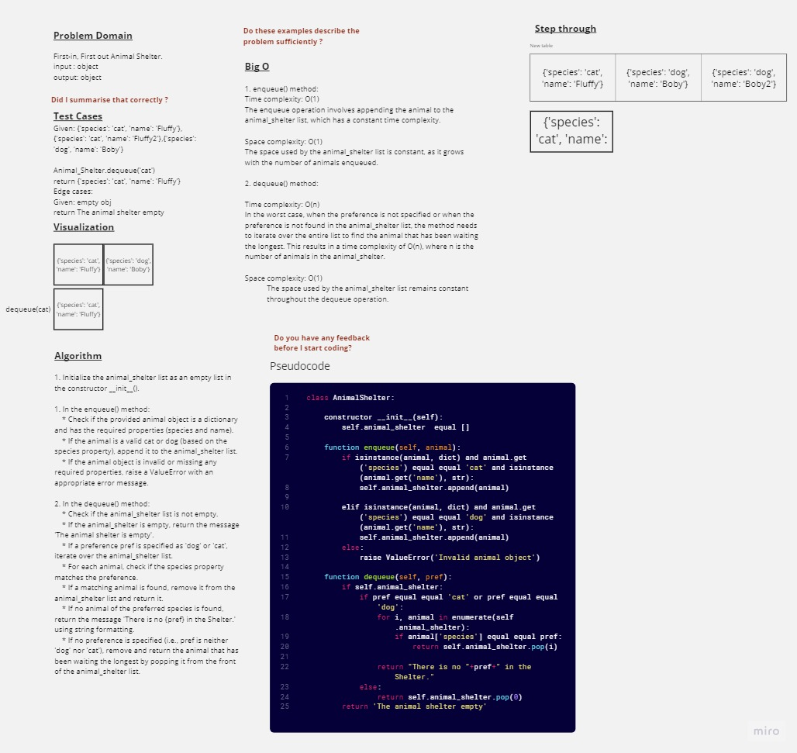

#  Animal Shelter
First-in, First out Animal Shelter.
## Whiteboard Process

## Approach & Efficiency

1. Initialize the animal_shelter list as an empty list in the constructor __init__().

1. In the enqueue() method:
    * Check if the provided animal object is a dictionary and has the required properties (species and name).
    * If the animal is a valid cat or dog (based on the species property), append it to the animal_shelter list.
    * If the animal object is invalid or missing any required properties, raise a ValueError with an appropriate error message.

2. In the dequeue() method:
    * Check if the animal_shelter list is not empty.
    * If the animal_shelter is empty, return the message 'The animal shelter is empty'.
    * If a preference pref is specified as 'dog' or 'cat', iterate over the animal_shelter list.
    * For each animal, check if the species property matches the preference.
    * If a matching animal is found, remove it from the animal_shelter list and return it.
    * If no animal of the preferred species is found, return the message 'There is no {pref} in the Shelter.' using string formatting.
    * If no preference is specified (i.e., pref is neither 'dog' nor 'cat'), remove and return the animal that has been waiting the longest by popping it from the front of the animal_shelter list.

    
### Big O
1. enqueue() method:

Time complexity: O(1)
The enqueue operation involves appending the animal to the animal_shelter list, which has a constant time complexity.

Space complexity: O(1)
The space used by the animal_shelter list is constant, as it grows with the number of animals enqueued.

2. dequeue() method:

Time complexity: O(n)
In the worst case, when the preference is not specified or when the preference is not found in the animal_shelter list, the method needs to iterate over the entire list to find the animal that has been waiting the longest. This results in a time complexity of O(n), where n is the number of animals in the animal_shelter.

Space complexity: O(1)
The space used by the animal_shelter list remains constant throughout the dequeue operation.

## Solution
Click [here](./stack_queue_animal_shelter.py)
