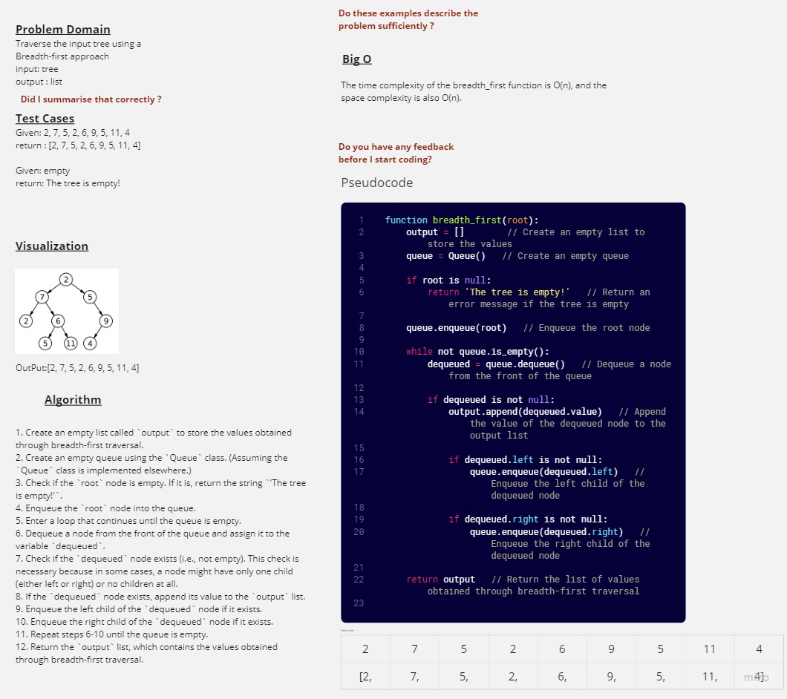

# Breadth-first Traversal
Traverse the input tree using a Breadth-first approach
input: tree
output : list

## Whiteboard Process

## Approach & Efficiency
### Approach
1. Create an empty list called `output` to store the values obtained through breadth-first traversal.
2. Create an empty queue using the `Queue` class. (Assuming the `Queue` class is implemented elsewhere.)
3. Check if the `root` node is empty. If it is, return the string `'The tree is empty!'`.
4. Enqueue the `root` node into the queue.
5. Enter a loop that continues until the queue is empty.
6. Dequeue a node from the front of the queue and assign it to the variable `dequeued`.
7. Check if the `dequeued` node exists (i.e., not empty). This check is necessary because in some cases, a node might have only one child (either left or right) or no children at all.
8. If the `dequeued` node exists, append its value to the `output` list.
9. Enqueue the left child of the `dequeued` node if it exists.
10. Enqueue the right child of the `dequeued` node if it exists.
11. Repeat steps 6-10 until the queue is empty.
12. Return the `output` list, which contains the values obtained through breadth-first traversal.

### Big O
The time complexity of the breadth_first function is O(n), and the space complexity is also O(n).

## Solution

Click [here](./tree_breadth_first.py)