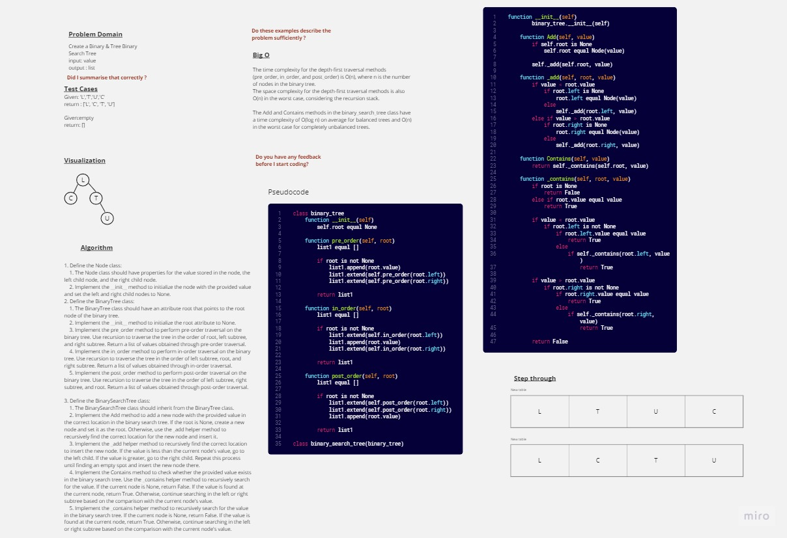

# Trees 
A tree data structure is a hierarchical structure that is used to represent and organize data in a way that is easy to navigate and search. It is a collection of nodes that are connected by edges and has a hierarchical relationship between the nodes. 

## Whiteboard Process

## Approach & Efficiency
### Approach
1. Define the Node class:
    1. The Node class should have properties for the value stored in the node, the left child node, and the right child node.
    2. Implement the __init__ method to initialize the node with the provided value and set the left and right child nodes to None.

2. Define the BinaryTree class:
    1. The BinaryTree class should have an attribute root that points to the root node of the binary tree.
    2. Implement the __init__ method to initialize the root attribute to None.
    3. Implement the pre_order method to perform pre-order traversal on the binary tree. Use recursion to traverse the tree in the order of root, left subtree, and right subtree. Return a list of values obtained through pre-order traversal.
    4. Implement the in_order method to perform in-order traversal on the binary tree. Use recursion to traverse the tree in the order of left subtree, root, and right subtree. Return a list of values obtained through in-order traversal.
    5. Implement the post_order method to perform post-order traversal on the binary tree. Use recursion to traverse the tree in the order of left subtree, right subtree, and root. Return a list of values obtained through post-order traversal.

3. Define the BinarySearchTree class:
    1. The BinarySearchTree class should inherit from the BinaryTree class.
    2. Implement the Add method to add a new node with the provided value in the correct location in the binary search tree. If the root is None, create a new node and set it as the root. Otherwise, use the _add helper method to recursively find the correct location for the new node and insert it.
    3. Implement the _add helper method to recursively find the correct location to insert the new node. If the value is less than the current node's value, go to the left child. If the value is greater, go to the right child. Repeat this process until finding an empty spot and insert the new node there.
    4. Implement the Contains method to check whether the provided value exists in the binary search tree. Use the _contains helper method to recursively search for the value. If the current node is None, return False. If the value is found at the current node, return True. Otherwise, continue searching in the left or right subtree based on the comparison with the current node's value.
    5. Implement the _contains helper method to recursively search for the value in the binary search tree. If the current node is None, return False. If the value is found at the current node, return True. Otherwise, continue searching in the left or right subtree based on the comparison with the current node's value.

The time complexity for the depth-first traversal methods (pre_order, in_order, and post_order) is O(n), where n is the number of nodes in the binary tree.

The space complexity for the depth-first traversal methods is also O(n) in the worst case, considering the recursion stack.

The Add and Contains methods in the binary_search_tree class have a time complexity of O(log n) on average for balanced trees and O(n) in the worst case for completely unbalanced trees.

## Solution

Click [here](./stack_queue_pseudo.py)